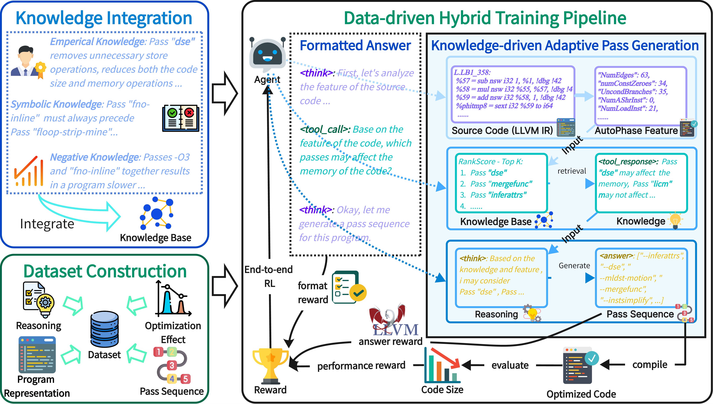

# AwareCompiler: Agentic Context-Aware Compiler Optimization

Official resources of **"AwareCompiler: Agentic Context-Aware Compiler Optimization via a Synergistic Knowledge-Data Driven Framework"**. [Hongyu Lin](https://arxiv.org/search/cs?searchtype=author&query=Lin,+H)\*, [Haolin Pan](https://arxiv.org/search/cs?searchtype=author&query=Pan,+H)*, [Haoran Luo](https://arxiv.org/search/cs?searchtype=author&query=Luo,+H), [Kaichun Yao](https://arxiv.org/search/cs?searchtype=author&query=Yao,+K), [Yuchen Li](https://arxiv.org/search/cs?searchtype=author&query=Li,+Y), [Libo Zhang](https://arxiv.org/search/cs?searchtype=author&query=Zhang,+L), [Mingjie Xing](https://arxiv.org/search/cs?searchtype=author&query=Xing,+M), [Yanjun Wu](https://arxiv.org/search/cs?searchtype=author&query=Wu,+Y). [[paper](https://arxiv.org/abs/2510.11759)]

[](https://opensource.org/licenses/Apache-2.0)

---

## Overview

Compiler optimization involves selecting and ordering optimization passes from a vast, structured space while preserving program correctness.  
Although LLM-based agents show promise, existing approaches often suffer from:

1. **Semantic misalignment** between abstract program features and concrete optimization passes  
2. **Brute-force exploration** with weak interaction between agents and compilers  
3. **Sparse and delayed rewards** in long-horizon optimization sequences  

AwareCompiler addresses these challenges through a **synergistic knowledge–data-driven framework**, enabling **context-aware, valid, and efficient optimization**.



## Experimental Setup

```bash
# Create and activate conda environment
conda create -n Aware-Compiler python==3.10
conda activate Aware-Compiler

# Initialize and update submodules
git submodule update --init --recursive

# Install verl and other dependencies
cd verl
pip3 install -e .
cd .. 
pip3 install vllm
pip3 install flash-attn --no-build-isolation
pip3 install FlagEmbedding
pip3 install faiss-cpu
```

---

## Training

To run **Experiment 1 and 2**, follow these steps:

```bash
# dataset perparation
cd examples/data_preprocess
PYTHONPTYH="../../" python3 compiler_autotuning_sft.py
PYTHONPTYH="../../" python3 compiler_autotuning_rl.py
```

```bash
bash train_sft.sh
bash train_rl.sh
```

---

## Inference

After training your models, follow these steps for inference:

1.  **Merge model weights:**

```bash
bash infer_model_merge.sh
```

2.  **Deploy the vLLM Service:**

```bash
bash infer_vllm_serve.sh
```

3.  **Run inference:**

```bash
bash infer_run.sh
```

---

## 📚 Citation

If you use AwareCompiler in your research, please cite:

```bibtex
@misc{lin2025awarecompileragenticcontextawarecompiler,
      title={AwareCompiler: Agentic Context-Aware Compiler Optimization via a Synergistic Knowledge-Data Driven Framework}, 
      author={Hongyu Lin and Haolin Pan and Haoran Luo and Yuchen Li and Kaichun Yao and Libo Zhang and Mingjie Xing and Yanjun Wu},
      year={2025},
      eprint={2510.11759},
      archivePrefix={arXiv},
      primaryClass={cs.PL},
      url={https://arxiv.org/abs/2510.11759}, 
}
```

## Feedback

Contributions and feedback are greatly appreciated! Whether you've found a bug, have a question, or want to suggest improvements, please open an issue. Your input helps make AwareCompiler better for everyone.

For further questions, please contact: hongyu2021@iscas.ac.cn, [panhaolin21@mails.ucas.ac.cn](panhaolin21@mails.ucas.ac.cn), haoran.luo@ieee.org.

